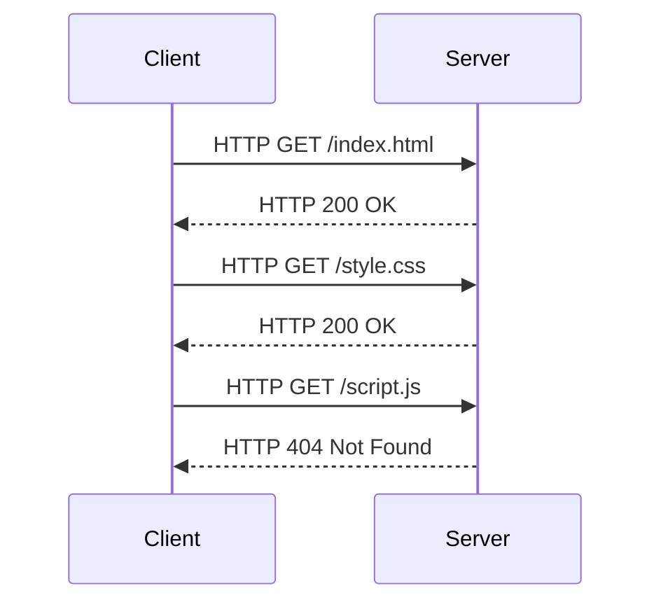

# Fundamentals

<Toc mode="onlySiblings" />

---

## What is the web

The world wide web is a network living on top of the internet (alongside things like email) that allows users to share documents and other resources.

This works by a client (browser) sending a request to a server, which then responds with a document that the client can read.

All these servers are connected to the internet an have an (IP) address like `126.31.231.102`.  
Commonly though, they are accessed by a `uniform resource locator` (URL) like `https://www.google.com` also called a domain name.

Domain names are translated to IP addresses by a `domain name system` (DNS) server. It gets utilized by the client in the background.

---
layout: two-cols
---

## How is data transfered

Generally, documents are transfered using the `hypertext transfer protocol` (HTTP).

The client sends a initial request to the server, which then responds with a `status code` and the document.

Usually the browser then parses the document and sends additional requests for resources like images, stylesheets and scripts.

[HTTP Status codes](https://developer.mozilla.org/en-US/docs/Web/HTTP/Status) are numbers that indicates the status of the request.

- `200` means everything is fine
- `404` means the document was not found
- `500` means the server encountered an error

::right::

---
layout: two-cols
---

## Not just the browser

Even though the browser is the most common client for most web applications, it is not the only one.

Different Servers or Applications can also act as clients and send requests to other servers.

The transfered data does not have to be a HTML document either. It can be any kind of data, like JSON, XML, images, videos, ...

This is generally called an `application programming interface` (API).
The client sends a request to the server, which then responds with the requested data.

::right::

<v-img src="./img/server.png" width="400px" height="500px" />
